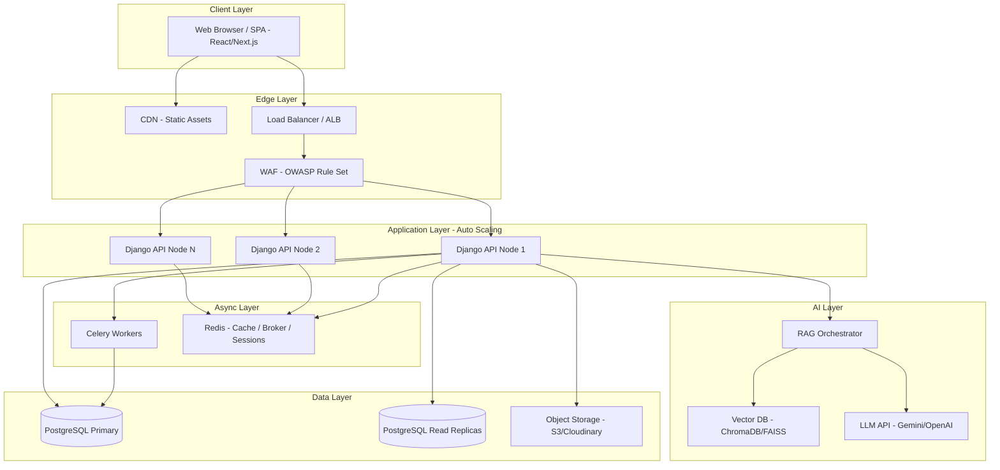
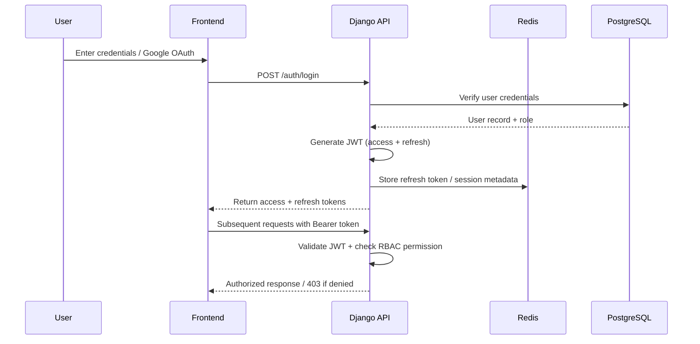

# AI-Powered Architecture Studio Management Platform with RAG-Based Assistant
 
## 1. Problem Statement
 
Many architecture and interior design firms still rely on emails, spreadsheets, phone calls, and manual documentation to manage clients, projects, quotations, design files, and communication. This fragmented workflow leads to inefficient project management, poor client engagement, delayed responses, and difficulties in organizing project-related information.
 
Potential clients often struggle to understand available services, explore previous projects, estimate project costs, and receive timely answers to their questions. As the number of projects increases, manually handling client requirements, scheduling meetings, managing documents, and responding to repetitive queries becomes increasingly challenging.
 
There is a need for a centralized digital platform that streamlines architecture studio operations while leveraging Artificial Intelligence to automate repetitive tasks, improve decision-making, and enhance the client experience.
 
The proposed solution is an AI-powered architecture studio management platform that enables architecture firms to manage projects, clients, documents, and communication through a unified system. The platform will also integrate Retrieval-Augmented Generation (RAG) capabilities to provide intelligent responses based on company portfolios, project documents, and service information.
 
---
 
## 2. Project Objectives
 
- Develop a centralized platform for architecture studio operations
- Enable efficient project lifecycle management
- Improve communication between clients and architects
- Implement secure authentication and authorization
- Provide role-based access control
- Automate requirement analysis using Artificial Intelligence
- Build a RAG-based assistant for intelligent question answering
- Manage project documents efficiently
- Provide real-time analytics and project insights
---

## 3. User Roles
 
| Role | Capabilities |
|------|--------------|
| **Visitor** | Browse projects/services, view company info, submit inquiries, use AI assistant |
| **Client** | Register/login, track project progress, upload documents, view milestones, access quotations, message architects |
| **Architect** | Manage assigned projects, update milestones, upload design files, review client requirements |
| **Admin** | Manage users/roles, assign projects, monitor progress, manage services/content, view analytics, configure AI/system settings |
 
---
 

## 4. System Architecture Overview
 

 
**Flow summary:** Client requests hit the CDN for static content or pass through the Load Balancer and WAF before reaching stateless Django API nodes. API nodes read/write through Redis (cache/session) and PostgreSQL (primary for writes, replicas for reads), offload heavy work to Celery, and route AI/RAG queries to the vector database and LLM provider. Files go directly to object storage via signed URLs.
 
---

## 5. Authentication & Authorization Flow
 

 
**Key controls:** short-lived access tokens, refresh token rotation, Redis-backed token blacklist on logout, and RBAC permission checks on every protected endpoint.
 
---

## 6. Core Features
 
### Authentication and Authorization
- User registration and login
- JWT-based authentication
- Refresh token mechanism
- Password reset functionality
- Role-Based Access Control (RBAC)
- OAuth 2.0 integration with Google

### Project Management
- Create and manage projects
- Assign architects to projects
- Track project status
- Manage project timelines
- Define project milestones
- Monitor project progress

### Document Management
- Upload project documents
- Store blueprints and floor plans
- Manage contracts and reports
- Secure file access based on user roles
- Cloud-based file storage

### Inquiry Management
- Contact form integration
- Lead capture and management
- Consultation request handling
- Inquiry status tracking

### Service Management
- Create and update services
- Dynamic service listing
- Service categorization

### Analytics Dashboard
- Total projects
- Active projects
- Completed projects
- Client growth metrics
- Lead conversion statistics
- Revenue insights
---