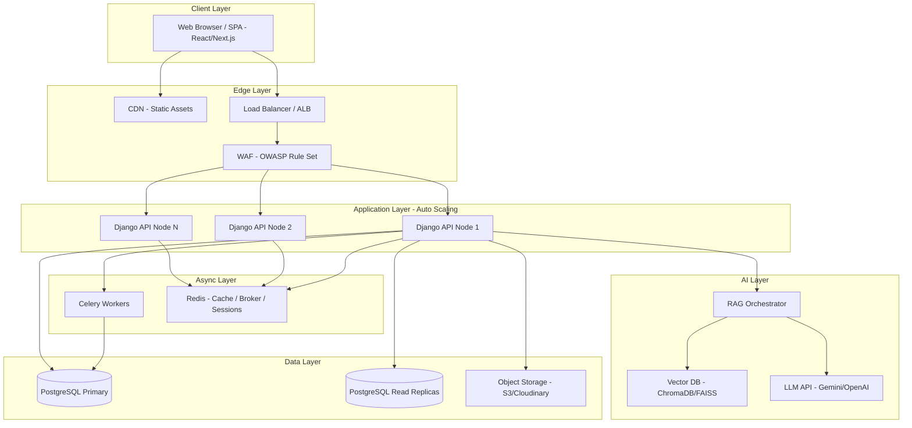
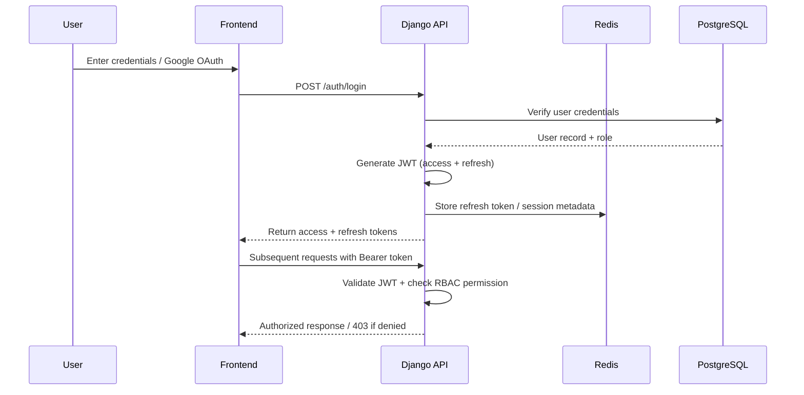
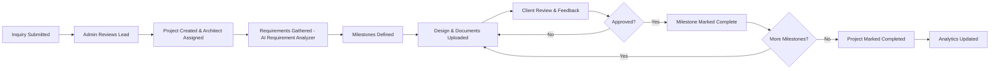
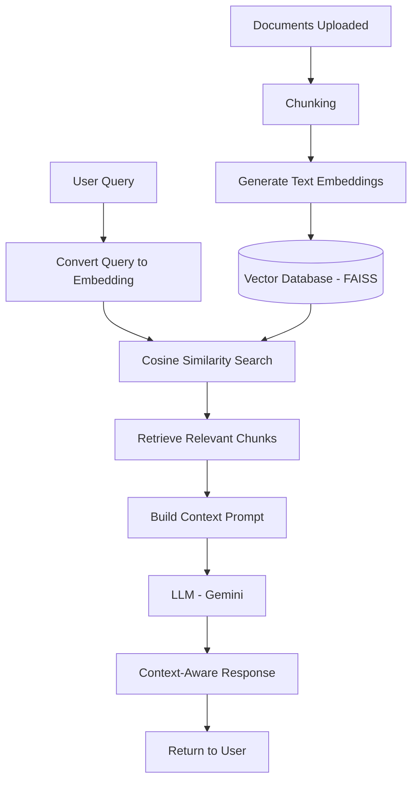

# AI-Powered Architecture Studio Management Platform with RAG-Based Assistant
 
## 1. Problem Statement
 
Many architecture and interior design firms still rely on emails, spreadsheets, phone calls, and manual documentation to manage clients, projects, quotations, design files, and communication. This fragmented workflow leads to inefficient project management, poor client engagement, delayed responses, and difficulties in organizing project-related information.
 
Potential clients often struggle to understand available services, explore previous projects, estimate project costs, and receive timely answers to their questions. As the number of projects increases, manually handling client requirements, scheduling meetings, managing documents, and responding to repetitive queries becomes increasingly challenging.
 
There is a need for a centralized digital platform that streamlines architecture studio operations while leveraging Artificial Intelligence to automate repetitive tasks, improve decision-making, and enhance the client experience.
 
The proposed solution is an AI-powered architecture studio management platform that enables architecture firms to manage projects, clients, documents, and communication through a unified system. The platform will also integrate Retrieval-Augmented Generation (RAG) capabilities to provide intelligent responses based on company portfolios, project documents, and service information.
 
---
 
## 2. Project Objectives
 
- Develop a centralized platform for architecture studio operations
- Enable efficient project lifecycle management
- Improve communication between clients and architects
- Implement secure authentication and authorization
- Provide role-based access control
- Automate requirement analysis using Artificial Intelligence
- Build a RAG-based assistant for intelligent question answering
- Manage project documents efficiently
- Provide real-time analytics and project insights
---

## 3. User Roles
 
| Role | Capabilities |
|------|--------------|
| **Visitor** | Browse projects/services, view company info, submit inquiries, use AI assistant |
| **Client** | Register/login, track project progress, upload documents, view milestones, access quotations, message architects |
| **Architect** | Manage assigned projects, update milestones, upload design files, review client requirements |
| **Admin** | Manage users/roles, assign projects, monitor progress, manage services/content, view analytics, configure AI/system settings |
 
---
 

## 4. System Architecture Overview
 

 
**Flow summary:** Client requests hit the CDN for static content or pass through the Load Balancer and WAF before reaching stateless Django API nodes. API nodes read/write through Redis (cache/session) and PostgreSQL (primary for writes, replicas for reads), offload heavy work to Celery, and route AI/RAG queries to the vector database and LLM provider. Files go directly to object storage via signed URLs.
 
---

## 5. Authentication & Authorization Flow
 

 
**Key controls:** short-lived access tokens, refresh token rotation, Redis-backed token blacklist on logout, and RBAC permission checks on every protected endpoint.
 
---

## 6. Core Features
 
### Authentication and Authorization
- User registration and login
- JWT-based authentication
- Refresh token mechanism
- Password reset functionality
- Role-Based Access Control (RBAC)
- OAuth 2.0 integration with Google

### Project Management
- Create and manage projects
- Assign architects to projects
- Track project status
- Manage project timelines
- Define project milestones
- Monitor project progress

### Document Management
- Upload project documents
- Store blueprints and floor plans
- Manage contracts and reports
- Secure file access based on user roles
- Cloud-based file storage

### Inquiry Management
- Contact form integration
- Lead capture and management
- Consultation request handling
- Inquiry status tracking

### Service Management
- Create and update services
- Dynamic service listing
- Service categorization

### Analytics Dashboard
- Total projects
- Active projects
- Completed projects
- Client growth metrics
- Lead conversion statistics
- Revenue insights
---

## 7. Project Lifecycle Flow
 

---
 
## 8. Artificial Intelligence Features
 
### AI Requirement Analyzer
Automatically extracts:
- Property type
- Plot dimensions
- Budget range
- Architectural style
- Number of rooms
- Project priorities

### AI Project Summary Generator
Generates structured project summaries based on client inputs.
 
### AI Cost Estimation
Provides estimated construction cost ranges based on project requirements.

### AI Design Recommendation
Suggests:
- Design styles
- Room distribution
- Space allocation
- Layout recommendations
---

## 9. RAG-Based Assistant
 
### Knowledge Sources
- Company portfolio documents
- Service brochures
- Project descriptions
- FAQs
- Company profile documents

### RAG Pipeline Flow
 

### Example Queries
- What services do you offer?
- Show completed villa projects.
- What is your design process?
- Which projects are available within a specific budget range?
---

## 10. Functional Modules
 
- User Management
- Authentication and Authorization
- Project Management
- Milestone Tracking
- Document Management
- Service Management
- Inquiry Management
- AI Requirement Analysis
- RAG-Based Assistant
- Analytics Dashboard
- Notification System
---

## 11. Scalability Architecture — Supporting 10,000 Concurrent Requests

### 11.1 Stateless Application Layer
All Django API instances are stateless; session data, JWT blacklists, and cache live in Redis, so any node can serve any request. This lets the Auto Scaling Group add/remove nodes freely.

### 11.2 Load Balancing
An Application Load Balancer (ALB) distributes traffic across API nodes with health checks removing unhealthy instances from rotation.
 

### 11.3 Horizontal Auto-Scaling
API nodes scale out/in based on CPU, memory, and request queue depth. Each node handles roughly 500–800 concurrent connections; 15–20 nodes comfortably cover 10,000 concurrent requests with headroom.

### 11.4 Database Scalability
- Connection pooling via PgBouncer to prevent connection exhaustion
- Read replicas handle read-heavy traffic (listings, portfolio browsing, analytics)
- Indexing on frequently filtered columns (project status, client ID, date ranges)
- Query optimization using `select_related` / `prefetch_related` to avoid N+1 storms

### 11.5 Caching Strategy (Redis)
- Response caching for expensive read-heavy endpoints
- Query result caching with short TTLs for dashboard aggregates
- Session and refresh-token caching to avoid DB hits per request
- Cache invalidation on relevant writes

 

### 11.6 Asynchronous Processing
AI requirement analysis, RAG document ingestion/embedding generation, cost estimation, and notifications run on Celery workers via a Redis/RabbitMQ broker — keeping API response times low regardless of AI/LLM latency. Worker pools scale independently based on queue depth.

### 11.7 CDN & Static Asset Offloading
Static assets and frontend bundles are served via CloudFront CDN; uploaded documents live in S3/Cloudinary, never served directly through app servers.
 

### 11.8 Rate Limiting & Throttling
Per-user and per-IP throttling (DRF Throttling / Redis token bucket) protects against traffic spikes and ensures fair resource allocation under load.
 
### 11.9 Observability & Auto-Recovery
CloudWatch / Prometheus + Grafana monitor latency, error rates, and saturation, triggering auto-scaling and alerts before degradation impacts users.
 
--- 

## 13. Security Architecture — OWASP Top 10 (2021) Compliance
 
| # | Risk | Mitigation Implemented |
|---|------|------------------------|
| **A01** | Broken Access Control | RBAC enforced on every endpoint; object-level permission checks (client can only access own project); deny-by-default policy |
| **A02** | Cryptographic Failures | TLS 1.2+ in transit; passwords hashed with Argon2/bcrypt; sensitive fields encrypted at rest; secrets in AWS Secrets Manager |
| **A03** | Injection | Django ORM parameterized queries; strict DRF serializer validation; sanitized input passed into RAG/LLM prompts to prevent prompt injection |
| **A04** | Insecure Design | Threat modeling for auth and file-upload flows; RBAC and rate limiting designed in from the start |
| **A05** | Security Misconfiguration | `DEBUG=False` in production; hardened headers (CSP, X-Frame-Options, HSTS); least-privilege IAM roles; env-based secret config |
| **A06** | Vulnerable & Outdated Components | Automated dependency scanning (`pip-audit`, `npm audit`, Dependabot) in CI/CD; scheduled patch cadence |
| **A07** | Identification & Authentication Failures | Short-lived JWT access tokens with refresh rotation and blacklisting; OAuth 2.0 federated login; lockout/backoff on repeated failed logins |
| **A08** | Software & Data Integrity Failures | CI/CD validates signed commits and dependency checksums; upload validation for type/size/content; no unsigned code at runtime |
| **A09** | Security Logging & Monitoring Failures | Centralized structured logging of auth events and access failures; audit trail for sensitive admin actions; real-time anomaly alerting |
